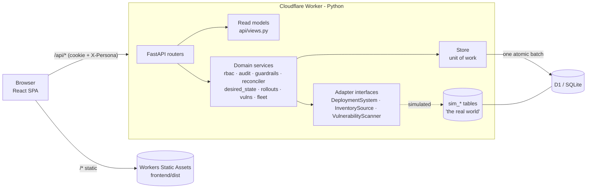
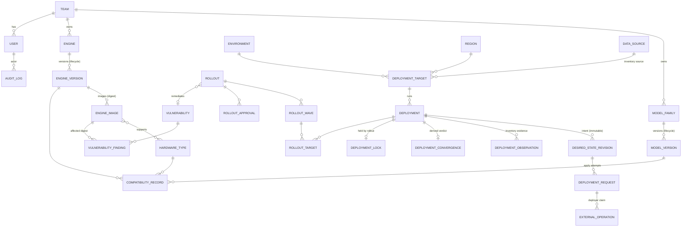
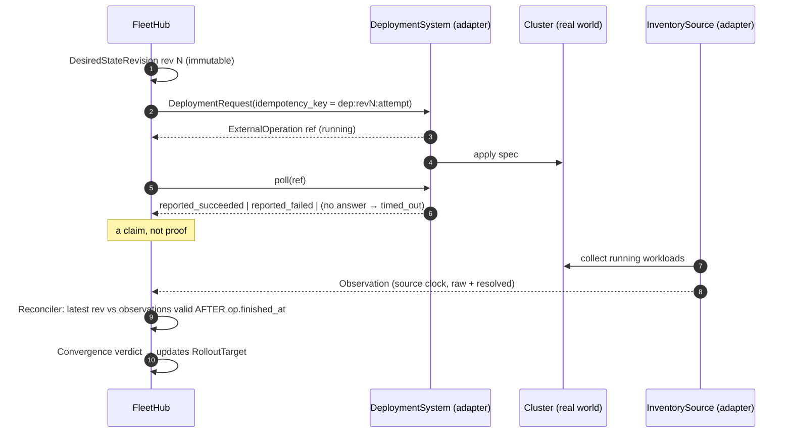
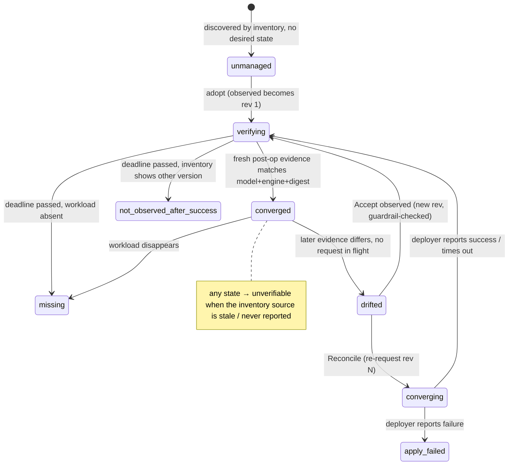

# FleetHub architecture

FleetHub is a central hub for AI models and inference runtimes across their lifecycle and across the
fleet. It answers: *what models and engines do we have, which combinations are supported, where are
they running, what needs attention, and how do we safely roll out updates?*

This document covers the runtime architecture, the data model, and — most importantly — the
**desired → observed reconciliation lifecycle** that every other feature builds on.

## 1. Runtime

* **One Python backend codebase runs in two places.** Locally and in tests: FastAPI on
  uvicorn with `sqlite3`. In production: the same FastAPI app inside a Cloudflare Python Worker via
  the Workers ASGI adapter, with D1 as the database.
* **D1 has no interactive transactions.** Every request therefore loads its (small) working set into
  an in-memory `Store`, domain code mutates plain rows, and `Store.flush()` writes the net change as
  **one atomic `batch()`** (inserts in FK order, then column-level updates, then deletes). The same
  code path runs on SQLite (`BEGIN … COMMIT`). History tables (audit log, rollout events,
  observations) are not loaded wholesale; read endpoints query them directly.
* **No background processes on Workers.** Simulated time advances only when someone advances it
  (demo controls) or while the UI is in *Play* mode (the browser posts `/api/sim/tick` every 2 s).
  Each tick runs the full control loop (§3.4). Concurrency is handled pragmatically for a prototype:
  idempotency keys on requests and monotonic clock updates; last-writer-wins on concurrent edits.
* **Adapters.** `adapters/interfaces.py` defines the three integration boundaries. The prototype
  ships simulated implementations that read/write `sim_*` tables (running workloads, in-flight
  operations, injected faults, CVE feed). FleetHub's own tables are only ever changed *through* the
  adapter interfaces, so desired vs. observed is genuinely computed, not hard-coded.

## 2. Data model

Entities are related, not free-form metadata. Every status family is its own column and vocabulary:
model lifecycle, engine lifecycle, compatibility, observed health, data freshness, convergence,
finding status, rollout status, approval status, wave status and target status never share values.

Notes:

* **Compatibility** is recorded per *model version × engine version × hardware type* with status
  `certified | compatible | known_issues | incompatible`. **No record means `untested`** — never
  implied compatible. "No image" (engine version ships no image for that hardware) is distinct again.
* **Vulnerabilities attach to image digests** (what scanners actually report) and roll up to engine
  versions. Exposure is computed twice: *observed* (inventory says the digest is running) and
  *desired* (a managed deployment's desired revision points at it). A same-tag hotfix image has a
  different digest and is therefore never mistaken for the catalog image.
* **Unknown is explicit.** Observations keep the raw reported strings (`model_raw`, `engine_raw`,
  `image_digest_raw`) next to the resolved catalog ids; an unrecognized value is shown as
  *unregistered*, not dropped.
* **Audit.** Every mutating service call writes `audit_log` (actor, role, action, entity, before,
  after, reason, correlation id = rollout id). System-detected transitions (drift, discovery,
  auto-remediation) are audited with actor `system`; simulated outside-world events as `sim.*`.

Schema: [`backend/migrations/0001_init.sql`](../backend/migrations/0001_init.sql).

## 3. Desired → observed reconciliation lifecycle

### 3.1 Principles

1. **Desired state is the source of truth for intent.** It is an immutable, numbered
   `desired_state_revision` per change (`seed | rollout | rollback | adopt | accept_drift | reconcile`).
   Only FleetHub writes it.
2. **Inventory is the source of truth for reality.** The deployer's operation result is recorded,
   but it is only a *claim*.
3. **Convergence is derived** by the reconciler (`domain/reconciler.py`, a pure function) from the
   latest revision, the latest request/operation for it, the latest observation and the source's
   freshness. Convergence, health, freshness and rollout-target status are separate axes.
4. Every step is a record with timestamps, so "why does the UI say X?" is always traceable — the
   deployment page renders the chain.

### 3.2 The chain

* **Idempotency & supersession.** One request per (deployment, revision, attempt). A newer revision
  supersedes any in-flight request for that deployment (best-effort `cancel`); late results of a
  superseded operation are recorded but never used for convergence.
* **Evidence ordering.** Observations are de-duplicated (a row is written only when what inventory
  reports changes); the latest one is valid through its source's `last_sync_at`. Only evidence valid
  *after* the operation finished counts, so a late, pre-operation snapshot can't confirm or deny.

### 3.3 Convergence states

| State | Meaning |
|---|---|
| `unmanaged` | Observed, no desired revision (e.g. `helm install` by hand) |
| `converging` | Request/operation in flight |
| `verifying` | Deployer finished; awaiting matching post-operation inventory evidence |
| `converged` | Fresh post-op evidence matches desired model version, engine version **and image digest** |
| `apply_failed` | Deployer reported failure, or never answered and inventory doesn't show the change |
| `not_observed_after_success` | Deployer claimed success, inventory still shows something else past the verify window |
| `drifted` | Was converged on this revision; later evidence differs with no FleetHub request in flight |
| `missing` | Desired, source fresh, workload not reported |
| `unverifiable` | No fresh evidence (stale or never-reporting source). Explicitly *not* OK |

Freshness is per source (`fresh_threshold_s`, `stale_threshold_s`); stale/unknown data renders as
`unknown` health and `unverifiable` convergence — never the last-known-good value.

### 3.4 One control-loop cycle (`domain/simulation.run_cycle`)

1. The (simulated) world executes due operations — this is where injected faults bite
   (`fail`, `phantom_success`, `unhealthy`, `no_result`).
2. FleetHub polls in-flight operations and records the deployer's claims; times out silent ones.
3. Due inventory and scanner sources sync (an offline source records an error and ages into stale).
4. The reconciler persists convergence transitions (audits drift/missing/discovery).
5. The rollout engine advances gates and waves (may submit new requests).
6. Vulnerability findings are maintained (auto-remediated when exposure reaches zero; expired risk
   acceptances reopen).

### 3.5 What counts as a successful deployment

A rollout target succeeds only when **all** hold:

1. the operation finished (`reported_succeeded`; or `timed_out` *and* inventory proves 2–4),
2. a **fresh** observation valid after `operation.finished_at` matches desired model version, engine
   version **and image digest**,
3. `replicas_ready ≥ desired replicas`,
4. health is `healthy` on every evaluation through the wave's bake window, and inventory has synced
   at or after the end of the bake window.

Otherwise the target fails with an explicit reason — `claimed_success_not_observed`,
`unverifiable_stale_inventory`, `health_gate`, `apply_failed`, `drifted_during_bake`, `missing` — the
wave fails, and the rollout **auto-pauses**. Humans then retry (new request, same revision), roll the
target back, or (admin only, justification required) **manually verify**, which is flagged distinctly
and never rendered as observed success.

### 3.6 Drift and manual changes

The reconciler flags `drifted` (with a field-level diff) and the attention queue lists it. Nothing is
auto-reverted (an emergency hotfix should not be silently undone). Platform engineers choose:

* **Reconcile** — new request for the current revision, or
* **Accept observed** — guardrail-checked new desired revision from what is running (an unregistered
  hotfix digest can't be accepted until it is registered).

### 3.7 Desired-state changes during a rollout

Submitting a rollout acquires a **lock** on each target deployment. While locked, adopt / reconcile /
accept-observed and inclusion in other rollouts are blocked with a pointer to the owning rollout.
Locks are released when a target is skipped, rolled back, or the rollout completes / is cancelled /
finishes rolling back. Rollout-internal changes are themselves revisions (`rollout`, `rollback`), so
history is append-only. Guardrails are **re-evaluated before every wave**: a new hard block (e.g. a
critical CVE published on the target image) or a new warning (e.g. the engine version was
deprecated) auto-pauses the rollout until the target is skipped or the warning is re-acknowledged.

## 4. Guardrails

`domain/guardrails.py` evaluates a proposed (model version, engine version) for one deployment:

| Level | Checks |
|---|---|
| **block** | unmanaged target · locked by another rollout · family mismatch · retired model · EOL engine · no image for target hardware · `incompatible` · target image affected by a critical CVE |
| **warn** (justification required, audited) | `untested` · `known_issues` · deprecated model/engine · experimental model or preview engine in prod · high CVE or risk-accepted finding on target image · stale target data |
| **info** | no change (desired already matches) |

## 5. Rollouts

* Status: `draft → ready → in_progress ⇄ paused → completed`, or `→ rolling_back → rolled_back`;
  `cancelled` from draft/ready/paused. **Approval is a separate axis**
  (`not_required | pending | approved | rejected`).
* Waves are auto-generated (non-prod → one prod canary → remaining prod grouped by region) and
  editable. Waves touching prod require one approval from a `release_approver` who is not the
  requester; non-prod waves may start before approval.
* Rollback of the whole rollout proceeds in reverse wave order; single-target rollback is also
  available. Both create new `rollback` revisions pointing at the pre-rollout spec.

## 6. RBAC

| Role | Can |
|---|---|
| viewer | read everything |
| model_owner | register model versions, lifecycle + compatibility for **their team's** models, draft/submit model rollouts |
| platform_engineer | engines/images/lifecycle, compatibility, adopt/reconcile/accept drift, create/submit/execute/pause/resume/retry/skip/rollback rollouts |
| security_engineer | triage findings incl. risk acceptance with expiry, draft remediation rollouts (cannot submit) |
| release_approver | approve/reject rollouts that touch prod (never their own) |
| admin | everything, plus manual verification |

Simulation controls (advancing the clock, injecting faults, resetting the demo data) are demo
infrastructure rather than governed actions, so every persona may use them.

Enforced in `domain/rbac.py` on every mutation; the UI only mirrors it.

## 7. Known prototype limitations

* Concurrency control is last-writer-wins at the column level (no optimistic version checks).
* The simulated world is coarse: one inventory source per region, operations take 3–7 simulated
  minutes, and health is a single value per workload.
* Auth is a shared demo password plus a persona switcher — not real identity.
* Python Workers have tighter CPU budgets than a container; long `advance` calls are capped at 12h
  per request.

## 8. Beyond the prototype

Proposed changes if FleetHub moves toward production:

* **[Phased integration with live systems](future-live-integration.md):** replace simulated adapters
  in phases, read-only first and non-prod before prod, prioritizing operational health. FleetHub must
  prove it sees the fleet correctly and that its own dependencies are healthy before it changes
  anything; a preflight check blocks rollouts while any dependency is unhealthy or unknown.
* **[Metric-based rollout gates](future-metric-gates.md):** gates check that serving metrics stay
  within acceptable ranges (TTFT, TBT/ITL, TTLT, error rate, throughput, output health) against SLOs
  and a concurrent baseline, not just that the new version is healthy.
* **[Governance over GitOps](future-gitops-governance.md):** FleetHub stops being the authoritative
  source of desired state. Git owns desired config, Argo CD / Flux apply it, and FleetHub governs
  changes (PR checks, guardrails, staged promotion) and verifies them against inventory.
* **[Compatibility evidence bound to immutable identity](future-compatibility-evidence.md):**
  compatibility moves from version labels to content-addressed identities (model artifact digest,
  image digest, serving config hash, platform profile), and the single "certified" status becomes
  per-dimension claims (functional, numerical, quality, performance, stability, safety) evaluated
  against a deployment's requirement policy.
